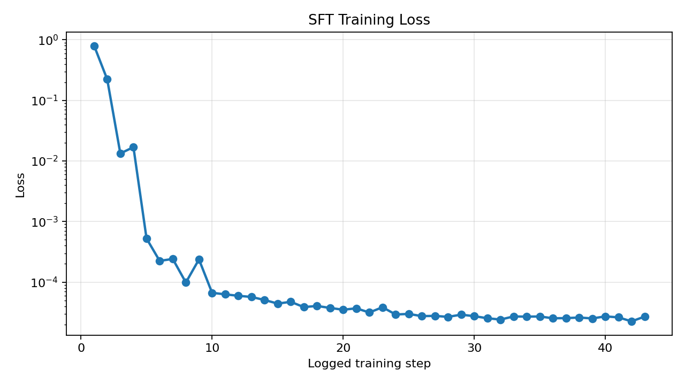

# CloudSREEnv 🛠️

> **OpenEnv × Meta Developers Hackathon Submission**  
> A multi-agent SRE incident-response environment where LLM agents learn to diagnose real production-style failures, avoid symptom-fixing traps, coordinate across roles, and execute the correct remediation through structured tools.

---

## Submission Links

| Artifact | Link |
|---|---|
| Hugging Face Space | **TBD: add HF Space URL** |
| Colab Training Notebook | **TBD: add Colab URL** |
| Mini-blog / Demo Video | **TBD: add HF blog or YouTube URL** |
| Slides | **TBD: optional slide deck URL** |
| Trained SFT Adapter | **TBD: add model/adapters URL if uploaded** |

---

## Why This Environment Matters

Modern LLM agents can often produce plausible incident-response text, but they struggle with the hard part of SRE work: maintaining state across tools, separating symptoms from root causes, coordinating handoffs, and knowing when an incident is actually safe to close.

`CloudSREEnv` turns that into an OpenEnv training problem. The agent sees partial observations, uses structured tools, receives deterministic rewards, and must progress through an incident workflow:

```text
Incident Commander -> L1 Triage -> evidence gathering -> root cause report -> L2 remediation -> closure
```

This directly targets two OpenEnv Hackathon themes:

- **Theme #1: Multi-Agent Interactions** — IC, L1, and L2 agents must coordinate through explicit messages and role boundaries.
- **Theme #3: World Modeling / Professional Tasks** — the environment simulates dynamic infrastructure state, tool feedback, causal failures, and delayed success criteria.

---

## What The Agent Learns

The environment is designed to teach an LLM to:

- diagnose before remediating,
- avoid fixing the service that only shows the symptom,
- gather enough evidence before reporting,
- respect role-based access control,
- use the correct tool for the root cause,
- close incidents only after RCA or remediation is complete.

The current training approach is **SFT-first**:

```text
Base Model -> Supervised Fine-Tuning -> Strict Evaluation -> Optional GRPO Refinement
```

GRPO is intentionally not the main claim right now. SFT teaches the workflow reliably; GRPO can later refine robustness, efficiency, and reward optimization.

---

## Project Structure

```text
CloudSREEnv/
├── server/
│   ├── app.py             # OpenEnv environment, simulator, rewards, terminal graders
│   └── __init__.py
├── prompts.py             # Shared IC / L1 / L2 prompts
├── train.py               # SFT-first entry point; GRPO disabled for now
├── train_sft.py           # LoRA SFT trainer with expert action trajectories
├── inference.py           # BASE / SFT / TRAINED strict evaluator + episode traces
├── scripts/               # Benchmark and README plot helpers
├── assets/                # README plot images
├── openenv.yaml           # OpenEnv task metadata
├── Dockerfile             # Hugging Face Space container
└── README.md
```

---

## Environment Design

`CloudSREEnv` is an OpenEnv-style simulator with:

- `reset(task_id)` to start an incident,
- `step(action)` to execute structured actions,
- observations from logs/status tables,
- dense rewards from composable rubrics,
- deterministic terminal grading for task success.

### Roles

| Role | Responsibility |
|---|---|
| `IC` | Delegates investigation/remediation and closes the incident |
| `L1_Triage` | Read-only diagnosis using `LIST_SERVICES` and `GET_LOGS` |
| `L2_DB_SME` | Applies infrastructure fixes like restart, scale, config update, or replica repair |

### Action Space

| Action | Purpose |
|---|---|
| `LIST_SERVICES` | Inspect service status, latency, memory, CPU, and cache epoch |
| `GET_LOGS(service_id)` | Fetch logs for a specific service |
| `MESSAGE_CHANNEL(target, message)` | Communicate between IC, L1, and L2 |
| `RESTART(service_id)` | Recover a crashed service |
| `SCALE(service_id, cpu_value)` | Increase CPU allocation for saturation |
| `UPDATE_CONFIG(service_id, memory_limit_mb)` | Cap memory for noisy-neighbor remediation |
| `REPAIR_REPLICA(service_id)` | Repair a stale cache replica after split-brain |
| `CLOSE_INCIDENT` | Close only when success criteria are satisfied |

---

## Scenarios And Tasks

| Task | Difficulty | Scenario | Success Condition |
|------|-----------|----------|-------------------|
| `task1_tls_certificate_rca` | Easy | Login failures caused by expired upstream TLS certificate | L1 checks `auth-api` logs, reports RCA, IC closes without remediation |
| `task2_self_healing` | Medium | `payment-db` CrashLoopBackOff / OOMKilled | L1 identifies crash, IC delegates, L2 restarts `payment-db`, IC closes |
| `task3_latency_resolution` | Hard | `auth-api` CPU saturation causing latency | L1 diagnoses CPU saturation, L2 scales `auth-api` to `>=2048`, IC closes |
| `task4_noisy_neighbor` | Hard | `payment-db` is slow because `notification-worker` consumes ~8000MB | Agent must avoid fixing victim `payment-db`; L2 caps `notification-worker` memory to `<=2048MB` |
| `task5_cache_split_brain` | Hard | `checkout-api` sees cart/session mismatch due to stale cache replica | L1 checks checkout and both cache nodes, compares epochs, L2 repairs `session-cache-replica` |

### Why Task 4 and 5 Are Important

These tasks are designed as **victim-vs-root-cause traps**:

- Task 4: `payment-db` looks slow, but `notification-worker` is the root cause.
- Task 5: `checkout-api` looks broken, but stale cache replica state is the root cause.

This makes the environment harder to game than simple “restart the failing service” benchmarks.

---

## Reward Design

The reward logic is implemented in `server/app.py` using composable signals:

- **Tool-use reward** for useful diagnostic actions.
- **Collaboration reward** for correct role handoff.
- **RBAC enforcement** so L1 cannot mutate infrastructure.
- **Principle reward** for new evidence, confidence gain, correct fixability classification, and correct remediation timing.
- **Duplicate-action penalty** to discourage repeated useless actions.
- **Terminal graders** that verify the final environment state, not just message text.

This makes the environment suitable for both supervised training and future RL refinement.

---

## Training Pipeline

### Current Recommended Path

```text
Qwen2.5-3B-Instruct
        |
        v
SFT on expert SRE trajectories
        |
        v
Strict evaluation without controller guardrails
        |
        v
Optional GRPO refinement later
```

SFT is used first because the model must learn the workflow structure before RL rewards can reliably refine it.

### Run SFT Training

```bash
python train.py
```

`train.py` currently launches `train_sft.py`. GRPO code is disabled for now to keep the comparison clean.

### Run Strict Evaluation

```bash
python inference.py
```

The evaluator supports:

```bash
# Option 1: edit EVAL_MODE in inference.py, then run:
python inference.py

# Option 2: run the benchmark helper for BASE/SFT and held-out comparisons:
python scripts/evaluate_benchmarks.py
```

Strict mode is enabled by default:

```python
STRICT_EVAL = True
```

That means inference does not force IC/L1/L2 transitions. The model must produce the actions itself.

---

## Results

### Strict Evaluation Summary

Fill this table after rerunning `BASE` and retrained `SFT` on the current 5-task version.

| Task | BASE Strict | SFT Strict | Notes |
|---|---:|---:|---|
| TLS Certificate RCA | TBD | TBD | RCA-only, no local remediation |
| Self-Healing | TBD | TBD | Restart `payment-db` |
| Latency Resolution | TBD | TBD | Scale `auth-api` |
| Noisy Neighbor | TBD | TBD | Cap `notification-worker`, not `payment-db` |
| Cache Split-Brain | TBD | TBD | Repair stale `session-cache-replica` |
| **Pass Rate** | **TBD** | **TBD** | Use strict mode only |

Previously, the SFT model passed the original 3-task strict evaluation. The current 5-task benchmark should be rerun after retraining with the updated SFT data.

### Plots

The following plot assets are generated under `assets/`. Re-run the generator after updating `episode_traces/benchmark_results.json`:

```bash
python scripts/generate_readme_assets.py
```



Caption: SFT loss over training steps. Lower loss indicates the model learned to emit structured expert actions.


Caption: Strict evaluation pass rate comparing the base model and trained SFT adapter.


Caption: Held-out evaluation uses paraphrased alerts and randomized values to test generalization instead of memorization.

---

## Episode Trace Dashboard

Each inference run writes JSON and Markdown traces under:

```bash
episode_traces/
```

Latest files are overwritten for quick inspection:

```bash
episode_traces/latest_task1_tls_certificate_rca.md
episode_traces/latest_task2_self_healing.md
episode_traces/latest_task3_latency_resolution.md
episode_traces/latest_task4_noisy_neighbor.md
episode_traces/latest_task5_cache_split_brain.md
```

These traces show:

- agent role per step,
- raw model reply,
- parsed action,
- environment observation,
- reward breakdown,
- success/failure state.

---

## Quick Start

### Local Setup

```bash
pip install -r requirements.txt
python train.py
python inference.py
```

### Docker / Hugging Face Space

```bash
docker build -t cloudsreenv .
docker run -p 8000:8000 cloudsreenv
```

---

## Hackathon Judging Alignment

| Criterion | How CloudSREEnv Addresses It | Status |
|---|---|---|
| Environment Innovation (40%) | Multi-agent SRE simulator with victim-vs-root-cause traps, dynamic state, and deterministic graders | Strong |
| Storytelling (30%) | README explains problem, environment, agent workflow, and demo path | Needs final artifact links |
| Showing Improvement (20%) | BASE vs SFT strict eval, episode traces, and generated README plots | Needs current 5-task rerun |
| Reward + Pipeline (10%) | Coherent composable reward design plus SFT-first training pipeline | Strong |

---

## Submission Checklist

- [ ] Add Hugging Face Space URL.
- [ ] Add Colab training notebook URL.
- [ ] Add mini-blog or YouTube video URL.
- [ ] Rerun SFT training after Task 4/5 additions.
- [ ] Run strict `BASE` benchmark across all 5 tasks.
- [ ] Run strict `SFT` benchmark across all 5 tasks.
- [ ] Run held-out strict benchmark.
- [x] Generate initial plot images under `assets/`.
- [x] Confirm `openenv.yaml` lists all 5 tasks.
- [ ] Confirm Hugging Face Space starts successfully.

---

## What You Still Need To Fill

- `TBD: add HF Space URL`
- `TBD: add Colab URL`
- `TBD: add HF blog or YouTube URL`
- `TBD: optional slide deck URL`
- `TBD: trained adapter URL if uploaded`
- BASE strict 5-task results
- SFT strict 5-task results after retraining
- Held-out strict results
- Updated final plot images in `assets/` after rerunning the 5-task benchmark

---

Built for the OpenEnv × Meta Developers Hackathon 2026.
